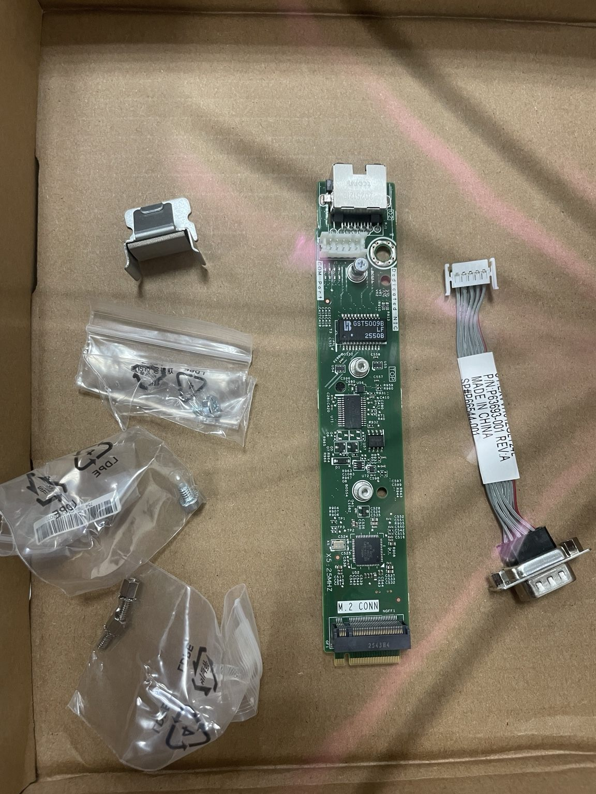
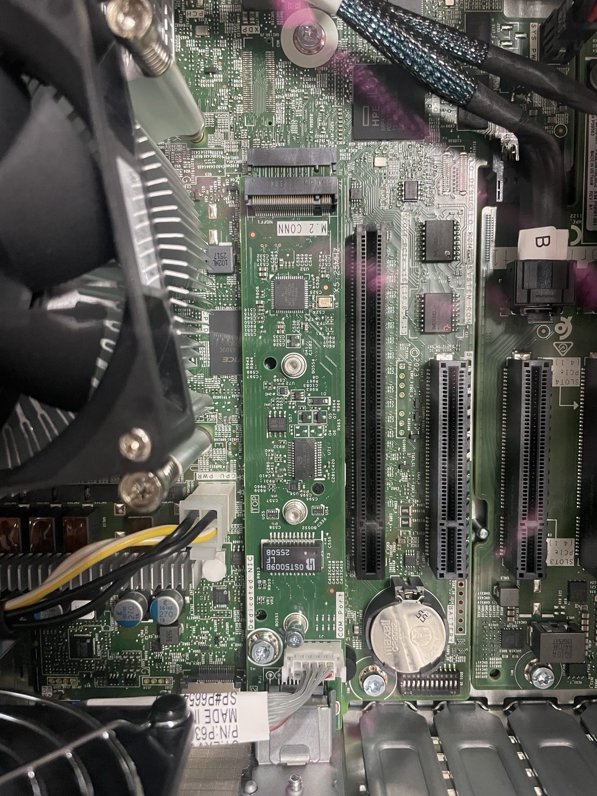
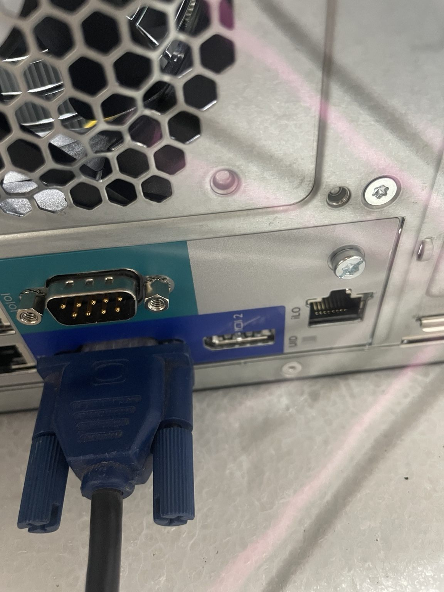
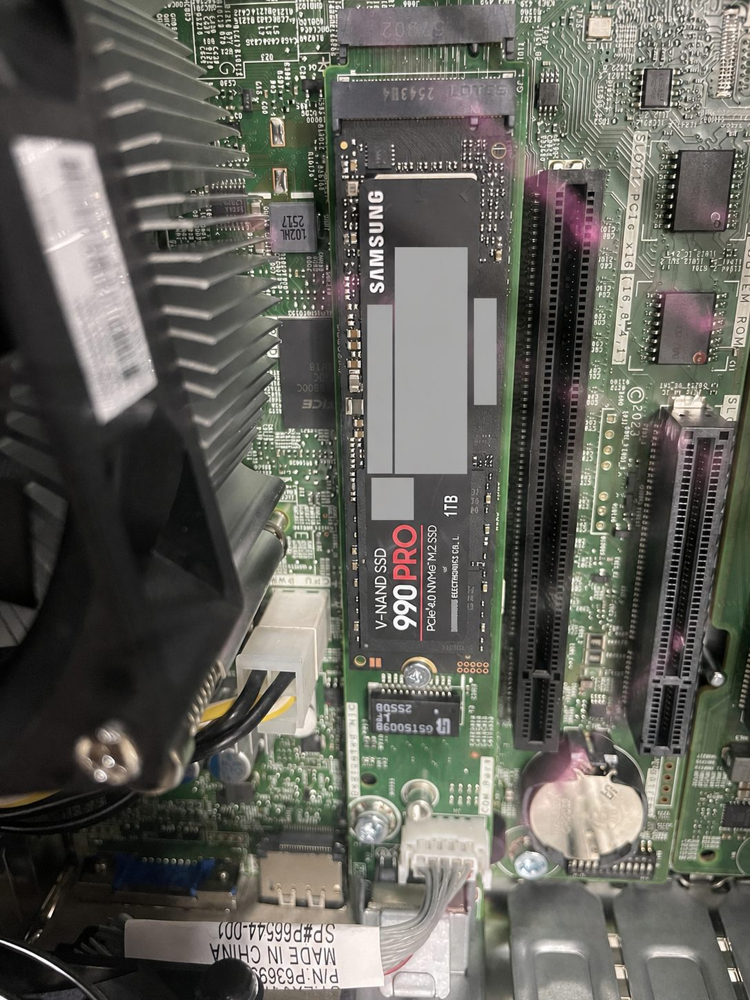
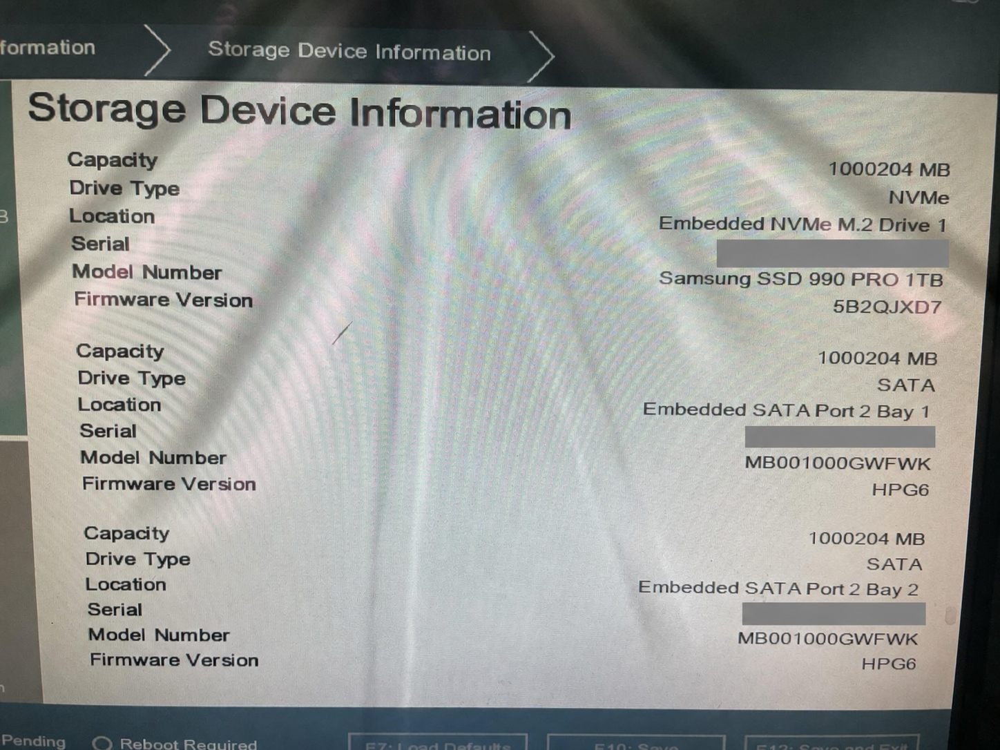
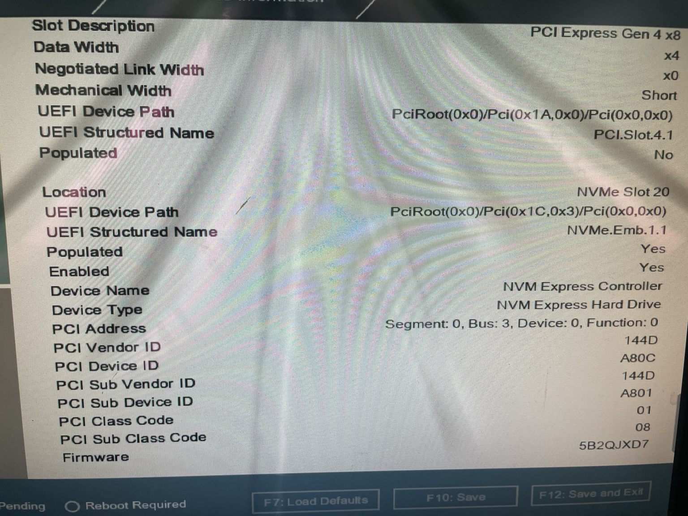
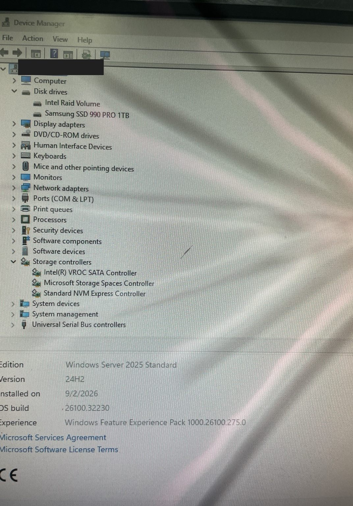

# HPE ProLiant ML30 Gen11：硬體擴充與 Windows Server 2025 實機驗證

## 摘要與驗證結論

本文記錄一台 HPE ProLiant ML30 Gen11 的完整實機擴充與安裝結果。已完成 **P65102-B21 Slimline ODD Enablement Kit**、**P65741-B21 iLO/NIC/M.2/COM Port Kit**、iLO Dedicated RJ45、DB9 Serial Port、Samsung SSD 990 PRO 1TB，以及 2 顆 SATA HDD 的 Intel VROC SATA RAID 1。Samsung 990 PRO 已通過 UEFI 辨識，並完成 **Windows Server 2025 Standard English** 安裝與裝置辨識驗證。

> **最終狀態（2026-09-04）：** Windows Server 2025 Standard English 已實機安裝成功；Version 24H2、OS build 26100.32230，安裝日期為 2026-09-02。Windows 已辨識 Samsung SSD 990 PRO 1TB、Intel Raid Volume、Intel(R) VROC SATA Controller 與 Standard NVM Express Controller。

## 實機組態與結果

| 項目 | 實機狀態 |
|---|---|
| Slim Optical Drive | `P65102-B21` Enablement Kit 已用於內接 Slimline ODD 組態 |
| iLO／M.2／COM 擴充 | `P65741-B21` 已安裝 |
| iLO 管理網路 | Dedicated iLO RJ45 已安裝 |
| Serial Port | DB9 Serial Port 已安裝於後方 I/O |
| M.2 NVMe | Samsung SSD 990 PRO 1TB 已安裝，UEFI 與 Windows 均辨識成功 |
| Data Storage | 2 × 1 TB SATA HDD，已建立 Intel VROC SATA RAID 1 |
| 作業系統 | Windows Server 2025 Standard English，實機安裝成功 |

## Slim Optical Drive：需另備 Enablement Kit

HPE QuickSpecs 將內接 Slimline ODD 列為選配，並明確註明選擇內接 ODD 時需要 **HPE ProLiant ML30 Optical Disk Drive Slimline Enablement Kit（P65102-B21）**。ODD Bay Kit 會占用一個 media bay；只購買 Slim Optical Drive 本體，不代表托架、面板與線材已齊全。

| 項目 | HPE 料號 | 說明 |
|---|---|---|
| ML30 Optical Disk Drive Slimline Enablement Kit | `P65102-B21` | 選擇內接 ODD 時必需；占用 1 個 media bay |
| 9.5 mm SATA DVD-ROM Optical Drive | `726536-B21` | ODD 本體；仍需搭配 Enablement Kit |
| 9.5 mm SATA DVD-RW Optical Drive | `726537-B21` | ODD 本體；仍需搭配 Enablement Kit |


## P65741-B21 iLO/NIC/M.2/COM Port Kit

本次加購並安裝 **HPE ProLiant ML30 Gen11 iLO/NIC/M.2/COM Port Kit（P65741-B21）**。依 HPE QuickSpecs 與 User Guide，此套件包含 dedicated iLO module、serial port cable，模組並提供一個 M.2 SSD 插槽。它的用途是增加 **iLO Dedicated Management Network Port**、M.2 插槽與 Serial Port；ML30 Gen11 原有 iLO 仍可使用 Embedded NIC 1 Shared Port。



### 主機板與後方 I/O 安裝





後方 I/O 可見新增的 Dedicated iLO RJ45 與 DB9 Serial Port。照片中的 VGA 線是現場作業連線，與套件功能無關。

## Samsung SSD 990 PRO 1TB 安裝



Samsung SSD 990 PRO 1TB 已實際安裝於 P65741-B21 的 M.2 插槽。照片中的產品序號、PSID、QR code 與條碼已遮蔽，只保留型號、容量與安裝位置。

> **支援邊界：** Samsung 990 PRO 是本次特定 ML30 Gen11 與 P65741-B21 組合的**實測成功**裝置，不宣稱它是 HPE 官方認證 SSD，也不代表所有零售 M.2 NVMe SSD 都受 HPE 支援。正式環境仍應評估韌體、溫度、耐寫度、健康監控、保固與長時間穩定性。

## UEFI 實機驗證

### Storage Device Information



UEFI 實測顯示：

| 欄位 | 實測值 |
|---|---|
| Capacity | `1000204 MB` |
| Drive Type | `NVMe` |
| Location | `Embedded NVMe M.2 Drive 1` |
| Model Number | `Samsung SSD 990 PRO 1TB` |
| Firmware Version | `5B2QJXD7` |

同一頁亦顯示兩顆 1 TB SATA HDD 位於 `Embedded SATA Port 2 Bay 1` 與 `Bay 2`。

### NVMe Slot 20



- Location：`NVMe Slot 20`
- Populated：`Yes`
- Enabled：`Yes`
- Device Name：`NVM Express Controller`

因此可確認 990 PRO 不只完成實體安裝，ML30 Gen11 UEFI 也已正常枚舉並啟用此 NVMe 裝置。

## Intel VROC SATA RAID 1 實機結果

兩顆 SATA HDD 已透過 ML30 Gen11 內建的 **Intel VROC SATA RAID** 建立 RAID 1，作為資料 Volume；Samsung 990 PRO 維持獨立 NVMe 系統碟，不加入 SATA RAID set。Windows Device Manager 顯示 `Intel Raid Volume` 與 `Intel(R) VROC SATA Controller`，證明作業系統已辨識 RAID Volume 與控制器。

依 HPE 最新 QuickSpecs：

- 所有 ML30 Gen11 型號支援 Intel VROC SATA RAID；BIOS 預設是 SATA AHCI，VROC SATA RAID 預設停用。
- 支援 RAID 0、1、5、10，且必須使用 UEFI Boot Mode。
- VROC SATA RAID Volume 不能在 Intelligent Provisioning 建立，必須手動建立。
- VROC SATA RAID OS driver 不包含在 HPE SPP，應由 HPE Support Center 取得符合 OS 的版本。
- RAID set 不可跨不同 drive form factor 或 drive cage；本次 NVMe 與 SATA HDD 分開使用。
- HPE 要求 OS 安裝 Agentless Management Service（AMS），以支援磁碟溫度感測及風扇控制。

```text
HPE ProLiant ML30 Gen11
├─ P65741-B21 M.2 slot
│  └─ Samsung SSD 990 PRO 1TB
│     └─ Windows Server 2025 Standard English（OS / System Disk）
├─ Embedded Intel VROC SATA RAID
│  ├─ SATA HDD #1
│  └─ SATA HDD #2
│     └─ RAID 1（Data Volume）
└─ iLO 6
   └─ Dedicated Management Port
```

## Windows Server 2025 Standard English 驗證



最新實機畫面確認：

| 驗證項目 | 畫面結果 |
|---|---|
| Edition | `Windows Server 2025 Standard` |
| Version | `24H2` |
| Installed on | `2026-09-02` |
| OS build | `26100.32230` |
| Disk drives | `Intel Raid Volume`、`Samsung SSD 990 PRO 1TB` |
| Storage controllers | `Intel(R) VROC SATA Controller`、`Standard NVM Express Controller` |

這張照片把先前的「OS 待安裝」正式更新為：**Windows Server 2025 Standard English 實機安裝、NVMe 與 Intel VROC RAID 1 辨識驗證成功。**

## Shared iLO 與 Dedicated iLO

P65741-B21 不是讓伺服器「開始具備 iLO」，而是增加獨立管理網路介面。HPE User Guide 指出，機載 **NIC 1／iLO Shared Port** 是預設 iLO port；安裝模組後才可使用 **iLO Dedicated Network Port**。

| 比較項目 | Embedded NIC 1 Shared iLO | iLO Dedicated Port |
|---|---|---|
| 實體介面 | 與主機網路的 NIC 1 共用 | 獨立 RJ45，只供 iLO 管理 |
| 額外硬體 | 原機可用 | 需要 `P65741-B21` |
| 使用情境 | 減少埠與佈線 | 管理網路需要獨立實體介面／交換器 |

切換到 Dedicated Port 前，應先規劃管理 VLAN、交換器、IP、DNS、監控與回復路徑，避免遠端切換後失聯。

## P65106-B21 Front PCI Fan and Baffle Kit

`P65106-B21` 不是所有組態都一律另購。QuickSpecs 指出：預組態 Performance Model 已包含；4LFF Hot Plug CTO 與 8SFF Hot Plug CTO 必須選擇；4LFF NHP CTO 與預組態 Entry Model 若選擇 M.2 SSD 或大多數 PCIe 卡時亦必須選擇，並有少數控制器／網卡例外。應以完整產品 SKU、機箱類型、現有風扇及全部擴充選項，用最新 QuickSpecs 與 HPE 核准組態工具判定。

## 驗證檢查清單

- [x] `P65102-B21` 與 Slimline ODD 實機組態完成
- [x] `P65741-B21` 套件與擴充板安裝完成
- [x] iLO Dedicated RJ45 與 DB9 Serial Port 安裝完成
- [x] Samsung SSD 990 PRO 1TB 實體安裝完成
- [x] UEFI 顯示 Embedded NVMe M.2 Drive 1
- [x] UEFI 顯示 NVMe Slot 20：Populated／Enabled = Yes
- [x] 2 × SATA HDD 建立 Intel VROC SATA RAID 1
- [x] Windows Server 2025 Standard English 安裝完成
- [x] Windows 辨識 Samsung 990 PRO、Intel Raid Volume、VROC SATA 與 NVMe Controller
- [ ] 依完整 SKU 複核 `P65106-B21` 是否為本機必要組件
- [ ] 完成 Dedicated iLO 網路、AMS、事件記錄、溫度、健康狀態與長時間穩定性檢查

## 官方資料來源

- [HPE ProLiant ML30 Gen11 QuickSpecs](https://www.hpe.com/psnow/doc/a50007008enw.html)
- [HPE ProLiant ML30 Gen11 Server User Guide：iLO-M.2-serial module option](https://support.hpe.com/hpesc/public/docDisplay?docId=sd00003390en_us&page=GUID-ECB17AD0-D417-4423-8953-388D17BBFB94.html)
- [HPE ProLiant ML30 Gen11 Server User Guide：iLO-M.2-serial module components](https://support.hpe.com/hpesc/public/docDisplay?docId=sd00003390en_us&docLocale=en_US&page=GUID-7DED8FBE-383D-4227-B481-30FCE01C26F9.html)
- [HPE ProLiant ML30 Gen11 Server User Guide：Installing the iLO-M.2-serial module](https://support.hpe.com/hpesc/public/docDisplay?docId=sd00003390en_us&docLocale=en_US&page=GUID-8BC7ACD9-F979-4D26-BEEE-F709C64C7B95.html)
- [HPE ProLiant ML30 Gen11 Server User Guide：Intel VROC support](https://support.hpe.com/hpesc/public/docDisplay?docId=sd00003390en_us&page=GUID-473A3C6B-AA6C-4C0C-89B1-4A3AD962BB15.html)
- [HPE Intel VROC Gen11 OS-specific guides and downloads](https://hpe.com/support/VROC-Gen11-UG)

查證日期：2026-09-04。HPE 可能更新 QuickSpecs、地區 SKU、支援矩陣與驅動下載位置；採購或部署前應再查最新版本。
