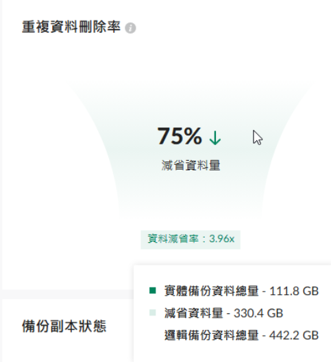

# DP340 + APM 2.0 Google Workspace 重複資料刪除實測紀錄

- 整理日期：2026-09-11（非截圖拍攝時間）
- 設備／軟體：Synology DP340／ActiveProtect Manager 2.0，依使用者提供的測試背景。
- 資料來源：使用者於「撰寫 Google Workspace 備份計劃」對話提供的原始 `image.png`，以及「經過幾天的測試」之說明。
- 關聯文件：[DP340 + APM 2.0 Google Workspace 備份與還原演練計畫](dp340-google-workspace-apm20-sop.md)。

## 1. 問題與觀察目的

在實際 Google Workspace 備份執行數天後，記錄 APM「重複資料刪除率」面板顯示的邏輯資料量、實體資料量與減省量，確認這批備份資料的容量節省效果。

本次畫面顯示重複資料刪除率 **75%**：邏輯備份資料總量 **442.2 GB**，對應實體備份資料總量 **111.8 GB**，減省 **330.4 GB**，資料節省率 **3.96x**。這是 DP340／APM 2.0 在這批實際 Google Workspace 備份資料中的觀察結果，不能泛化為所有環境的保證值。

## 2. 證據：原始截圖與數據

截圖由使用者提供，原圖未經修改，於本 repository 以描述性檔名保存。畫面可見容量指標，未見帳號、網域、IP 或金鑰等敏感資訊。截圖本身未呈現設備型號、APM 完整版本、工作負載篩選條件或拍攝時間；DP340／APM 2.0／Google Workspace 的背景來自使用者說明，不是由這張局部畫面獨立辨識。

| 畫面欄位 | 原始讀值 | 本次解讀 |
|---|---:|---|
| 重複資料刪除率 | 75% | 面板顯示的整數百分比 |
| 實體備份資料總量 | 111.8 GB | 此統計範圍內顯示的實體備份資料量 |
| 減省資料量 | 330.4 GB | 此統計範圍內邏輯量與實體量之差 |
| 邏輯備份資料總量 | 442.2 GB | 面板所統計的邏輯備份資料量 |
| 資料節省率 | 3.96x | 邏輯量相對實體量的倍數，保留畫面原值 |

容量單位沿用畫面 GB，未轉換為 GiB，也未取得未四捨五入的底層數值。

## 3. 驗證：容量關係與比率

使用畫面已四捨五入至小數一位的數據核算：

- 容量加總：111.8 + 330.4 = **442.2 GB**。
- 減省比例：330.4 ÷ 442.2 × 100% ≈ **74.72%**，取整數約為 **75%**，與面板一致。
- 實體量占邏輯量比例：111.8 ÷ 442.2 × 100% ≈ **25.28%**。
- 邏輯／實體倍數：442.2 ÷ 111.8 ≈ **3.9553x**，取小數二位為 **3.96x**，與面板一致。

因此，在這次統計口徑下，約 111.8 GB 的實體備份資料對應 442.2 GB 的邏輯備份資料。**3.96x 是容量倍數，不是節省 396%，也不是備份或還原速度提升 3.96 倍。**

## 4. 處置與技術判讀

本次處置為保存原始截圖、轉錄數據、核算一致性，並與既有建置 SOP 建立連結；未因這張截圖變更備份設定。

數據在上述核算下相互一致，可作為此批資料於觀察時點的重複資料刪除效果紀錄。此處沿用 APM 面板名稱描述結果；僅憑這張畫面，無法進一步拆分重複資料刪除、壓縮或其他底層機制各自的貢獻，也無法確定重複內容來自跨版本、跨使用者或其他來源。

邏輯備份資料總量不應直接當作 Google Workspace 來源端的唯一資料量；實體備份資料總量也不等同整台 DP340 的磁碟使用量。截圖沒有提供系統、中繼資料或其他儲存開銷的完整口徑。

## 5. 限制與風險

- 本次為執行數天後的單一觀察時點，沒有逐日數列或對照組，不能推論長期趨勢或宣稱每個環境都能節省 75%。
- 未提供精確測試起訖時間、備份次數、保留版本數、使用者數、各服務資料占比、完整 APM build 與面板統計範圍。截圖亦無法獨立確認是否混入其他工作負載。
- 不同資料組成、變更量、版本保留及統計範圍可能使結果不同；本次 3.96x 不宜直接作為其他環境的容量承諾。
- 容量節省不代表備份完整性或可還原性已驗證。既有 SOP 的第一次測試仍記載 Google Drive 還原 Pass、Gmail 備份 Fail 且原因待查；本次截圖不能證明 Gmail 問題已解決，也不能推論所有 Google Workspace 服務都成功。
- 本次未測量備份吞吐量、API 流量、還原時間或 RPO／RTO。

## 6. 後續追蹤項目

後續觀察可在相同面板與統計範圍下，記錄時間、APM build、納入的服務、備份次數、保留版本與上述五項容量指標，並標註保留政策或資料範圍的異動。另依既有 SOP 留存各服務備份狀態與抽樣還原結果；這些是後續驗證項目，並非本次已完成的測試。

## 7. 版本紀錄

| 日期 | 異動 |
|---|---|
| 2026-09-11 | 初版：保存使用者原始截圖，記錄 75%、111.8 GB、330.4 GB、442.2 GB、3.96x，完成數據核算並列明適用範圍。 |
